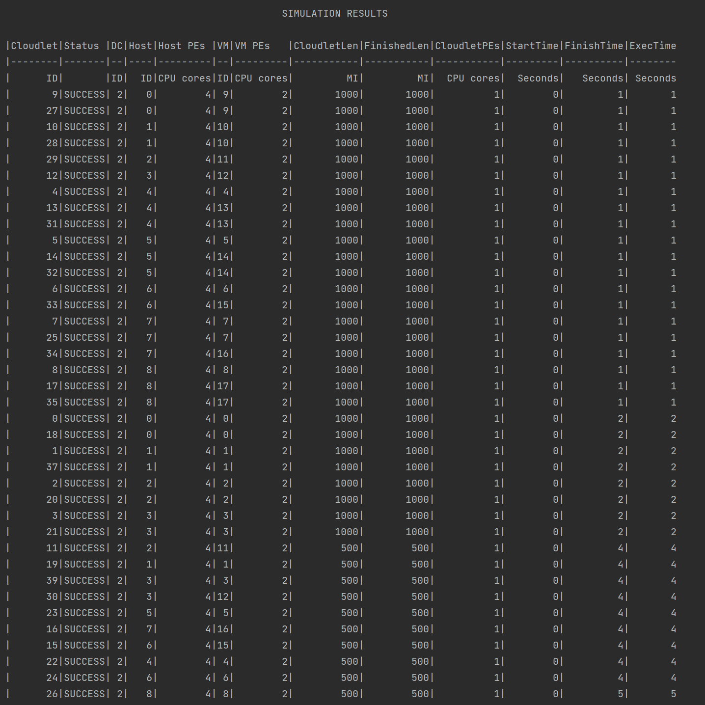
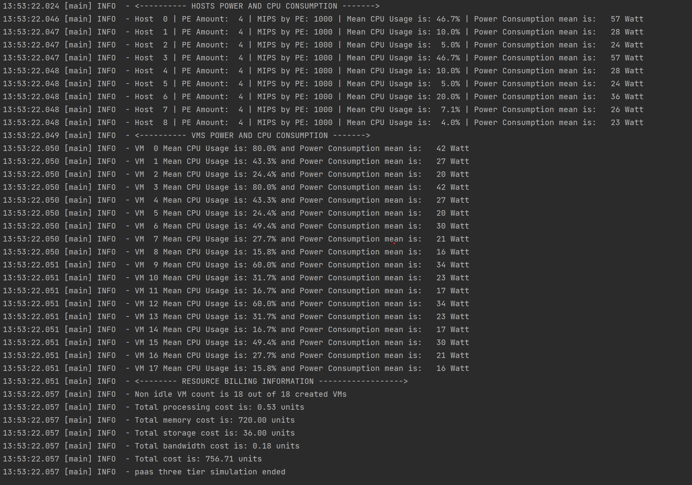
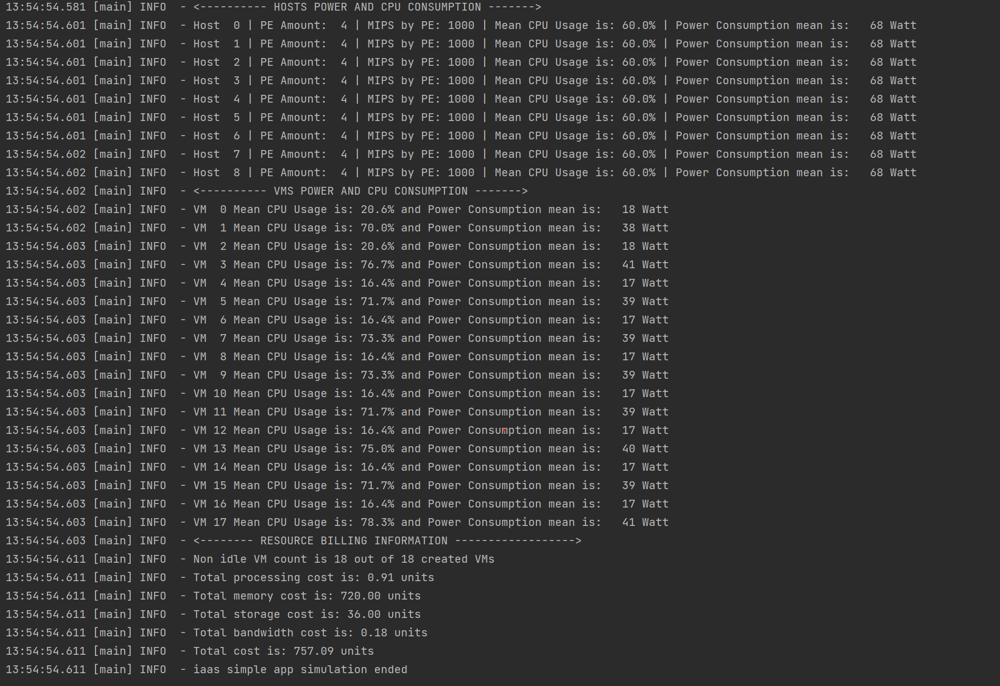
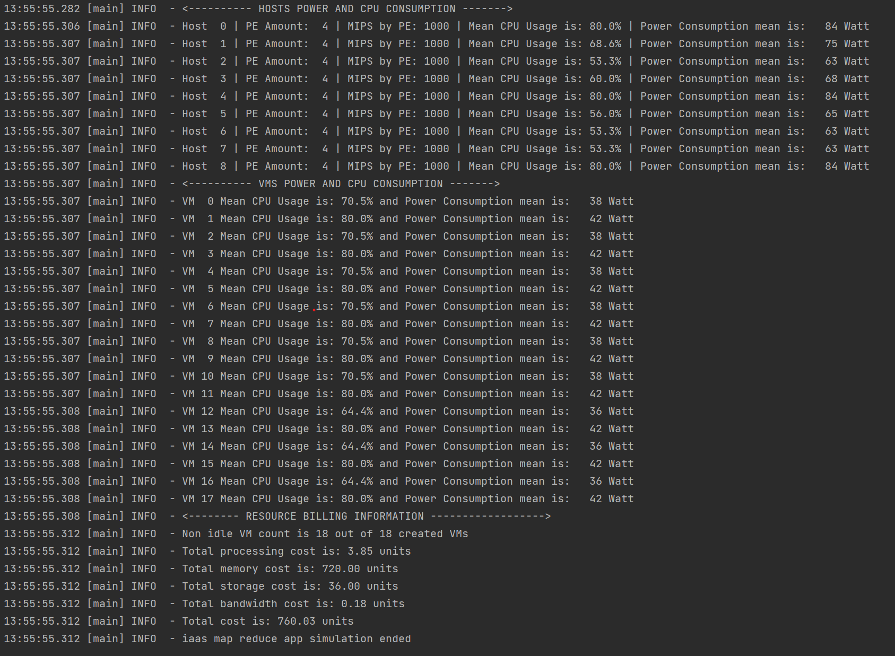

# CS-441 Cloud Computing Objects
## Homework 2 Documentation
## By: Rajat Kumar (UIN: 653922910)

## Cloud Organization Simulations using CloudSimPlus and Scala

---
## Introduction

This homework involves demonstration of creating different cloud organizations using CloudSimPlus (a framework for simulation of cloud infrastructure and its properties with great accuracy).
The tasks for this homework includes creating different cloud architectures with changing properties and assigned workload to conclude which architecture is best for certain circumstances.
Also, SAAS(Software as a Service), PAAS(Platform as a service), IAAS (Infrastructure as a Service) and FAAS(Function as a service) models have also been simulated upto some extend with project specific constraints.
All of these tasks are described in the later sections of this documentation.
---

## How to run the application
1. Download IntelliJ or your favourite IDE. The application is developed using IntelliJ IDE, and it is highly recommended to use it for various reasons.
2. Make sure you have Java SDK version 18 installed on your machine.
3. Also, it is assumed that your machine have git (version control) installed on your machine. If not, please do.
4. Clone this repository from GitHub and switch to `main` branch. This is where the latest code is located.
5. Open IntelliJ, and open up this project in the IDE environment. Or you can do `New - Project from Version Control` and then enter the GitHub URL of this repository to load in directly into your system if not cloned already.
6. The application's code is written using Scala programming language. The version used for Scala is `3.2.1`.
7. For building the project, `sbt` (Scala's Simple Build Tool) is used. Version `1.8.0` is used for sbt.
8. All the dependencies and build setting can be found in `build.sbt` file.
9. Once intelliJ is successfully detected the Scala, sbt, and right versions for both of them, the project is ready to be compiled/built.
10. Go to terminal at the bottom of IntelliJ, or open any terminal with path being set to the project's root directory.
11. Enter `sbt clean compile`, the project will start building.
12. Test cases are written using a library called `ScalaTest`.
13. All the test cases are in `src/test/scala/CloudOrgSimulationTest.scala.scala` file. You can even add your own test cases to test the application even more.
14. You can run the tests using `sbt test` to see the if all test cases pass or not. As of the moment this documentation is written and probably the time when you will be testing, all the test cases will pass (hopefully).
15. 17. Please make sure your machine have `java version 17` or above because cloud sim only works with those versions. If not, please use sbt shell instead and enter `test`.
16. To run the application, do `sbt run` if you have the correct java version, otherwise use sbt shell again and type `run`. It will all the simulations in `src/main/scala/CloudOrg/RunSimulations.scala` file. 
17. If you want to see individual simulation or add other simulation, comment out some and run accordingly. The code there is pretty intuitive.
18. Finally, run `sbt assembly` or `sbt clean compile assembly` if you want to merge the compilation and generating fat jar step together.
19. The `sbt assembly` command will generate a fat jar file that will contain your application's byte code as well as the code from dependencies that the application is importing.
20. The jar file will be generating in `target/scala-3.2.1/` directory with name `CS441-Homework3-assembly-1.0.0-cloudOrgSimulator.jar`.
21. That's it, this jar file can be deployed in a container using docker and dockerhub.

---

### Docker Deployment

### Applications
Three types of applications (cloudlets) exists in the simulations.
1. Simple Cloudlet - Various simulation have done with simple cloudlet with different attributes and utilization models. This application represent a single task application.
2. Map Reduce Network Cloudlet - A single map reduce application consists of 4 network cloudlets, 3 of them are mappers and 1 is reducer. Mapper has an execution task and a send task. Reducer also have an execution task as well as a receive task.
Please refer to `src/main/scala/CloudOrg/Applications/MapReduceJob.scala`.
3. Three Tier Network Cloudlet - This application consists of 3 network cloudlets each (representing client, server and database/service). Client cloudlet has an execute task, send to server task, receive from server task. Server cloudlet has five tasks (2 execute tasks, one send to client task, one send to service/database cloudlet, one receive from client task, and one receive from service/database cloudlet).
Finally, database/service cloudlet has 3 tasks, one execute task, one receive from server task and one send to server task.
Please refer to `src/main/scala/CloudOrg/Applications/ThreeTierApplication.scala` for more details.

## Experiments and its Attributes
The experiments performed with this project revolves around three types of applications which is described in later sections.

### Datacenter
Experimentation is done with six types of datacenters.
1. `DatacenterSimple` - This datacenter is used for basic simulation and performs good normal simple cloudlets.

2. `StarNetworkDatacenter` - Implemented star topology by connecting host in a certain star fashion using edge switches, aggregate switches. The way host are connected is shown the topology diagram.

3. `TreeNetworkDatacenter` - Implemented tree topology by connecting host in a tree structure using edge switches, aggregate switches. Tree network is best suited for Map reduce jobs are per the experiments performed. The way host are connected is shown the topology diagram.

4. `BusNetorkDatacenter` - Implemented tree topology by connecting host in a tree structure using edge switches, aggregate switches. The way host are connected is shown the topology diagram.

5. `RingNetworkDatacenter` - Implemented ring topology by connecting host in a ring structure using edge switches, aggregate switches. The way host are connected is shown the topology diagram.

6. `HybridNetworkDatacenter` - Implmented hybrid network which is mix of star, ring and tree-bus mix structure. As per the experiments, it is suited for simple cloudlet execution. The way host are connected is shown the topology diagram.

### Broker
We experimented with three types of broker.
1. `DatacenterBrokerSimple` - This broker performs well in a single datacenter cloud organization.
2. `TopologyAwareBrokerHeuristic` - This is a custom implemented broker which takes into consideration various topologies and type of tasks/cloudlets passed into consideration and send particular type of cloudlets to particular type of datacenter. This broker also extends the functionality of DatacenterBrokerHeuristic and can be used with any type of heuristic.
3. `TopologyAwareBrokerBestFit` - This is also a custom implemented broker which takes into consideration various topologies and type of tasks/cloudlets passed into consideration and send particular type of cloudlets to particular type of datacenter. However, this extends best fit broker functionality so as per my experiments, it performed better than heuristic one and hence, decided to be used for multi-datacenter experiment.

### Hosts
Other experiments are done with hosts, networks hosts, their capacity, processing power, processing elements (cpu cores), ram, bandwidth, storage and how VMs are allocated to it through its datacenter.
Network hosts are also created to gain advantage of network topologies and various network topologies have been implemented.

### VMAllocationPolicy
Implemented `Simple`, `Bestfit`, `Random` and `RoundRobin` policies for vm allocation. Out of them BestFit and Simple were found to be most performant.

### VMs
Virtual Machines are created and submitted to broker for simulation. These will have different characteristics like
capacity, processing power, processing elements (cpu cores), ram, bandwidth, storage. Also, VMs are provided with particular VM scheduler which schedules the execution of VM on host on which they are created.

### VM Schedulers
Implemented `Timeshared`, `Spaceshared`, `Random` (custom created) and `PseudoRandom` (custom created - mix of random and spaceshared).
Both Timeshared and Spaceshared can be used to achieve great performance, however, they needs to be used in conjucture with certain type of cloudlet scheduler to achieve greater results.

### Cloudlets
Cloudlets are basically the task the cloud customer sends to the cloud provider to be executed on the resources provided by cloud organization.
This project uses two types of cloudlets - CloudletSimple and NetworkCloudlet. CloudletSimple can have one level of execution, however, network cloudlet have subtasks which can be used to further perform executions as well as create send and receive events for communicating with other cloudlets. 
In this project network cloudlet is used to create complex applications to test the efficiency of cloud organization and the underlying network topologies.

### Cloudlet Schedulers
Implemented `Timeshared`, `Spaceshared`, `Fair` schedulers for experimenting. This scheduler refers to scheduling execution of cloudlets on a particular VM and its functionality actually makes a decision on whether to execute in on the a particular VM or not (based on different factors).

As per my experiment, best results are achieved when either VM scheduler is timeshared or spaceshared and cloudlet scheduler is either timeshared and spaceshared and neither one of them is same (they are exclusive).

### Power Modeling
This project also provides how much of static and max power a host can use. Also implemented startup and shutdown delays and power consumption.

### Cost Modeling
This project also involves creating cost models where particular type of resource (computing, memory, bandwidth, storage) accesses will incur a particular cost the user.

### AutoScaling
In this project we have used Vertical scaling for CPUs(VMs) and horizontal scaling for memory by configuring certain threshold and predicates.

### Utilization Modeling
CPU, RAM and bandwidth utilization models are created with dynamic utilization of resources and how that would change resouces needed by cloudlets.

---

## Results of the experiment
Results are included for the models which are best for their input, for example Tree Network datacenter is best for mapReduce application.
So, I have included in this documentation only the tree network datacenter simulation. However, simulations for other topologies for map reduce are performed and their code is available in the respective package in the repository.

### 1. Basic Example (Cloudsim introduction)
The first experiment is the basic one. In this there is only Datacentersimple with simple cloudlet and no custom scheduler.
Results are:

Also, there are no performance metrics captured for this one.

### 2. Simple Cloudlet Tasks (Hybrid model used)
For this I have used Hybrid model and included the results here as hybrid model was the best performant for executing simple in terms of consistency in results as well as timely execution of cloudlets.
However, the ring network was also showing similar performance.

Execution table: This might be larger in actual than in image. Please refer to `src/main/scala/CloudOrg/Simulations/HybridTopologySimulations/HybridTopologySimpleCloudletSimulation.scala`

Power Consumption and Cost:

### 3. MapReduce Network Cloudlets (Tree Model used)
With my experiments, the tree performed the best for mapreduce cloudlets and hence is chosen for results of this documentation.

Execution table: This might be larger in actual than in image. Please refer to `src/main/scala/CloudOrg/Simulations/TreeTopologySimulations/TreeTopologyMapReduceSimulation.scala`

Power Consumption and Cost:

### 4. Three Tier App Network Cloudlets (Ring Model used)
My experiments showed that ring network performed the best among other topology models for three tier application cloudlets execution.
However, bus, tree and star were consistent and performed relatively good.

Execution table: This might be larger in actual than in image. Please refer to `src/main/scala/CloudOrg/Simulations/TreeTopologySimulations/TreeTopologyMapReduceSimulation.scala`

Power Consumption and Cost:

### 5. Multi-datacenter Cloud Organization (Cloud Architecture)
This is the main simulation where a large cloud organization is formed by connecting multiple datacenter of different topologies together and finding out how the cloudlets would execute.
Here I have used `TopologyAwareBrokerBestFit` as it will send complex mapreduce cloudlets to TreeNetworkDatacenter, complex three tier app cloudlets to RingNetworkDatacenter and other simple cloudlets to any datacenter based on the allocation and scheduler policies.

Here is the diagram of cloud organization created with multiple datacenters.

Execution Table: Since there are hundreds of cloudlets in this simulation, I will not be able to show all of them in a single image.
Please refer to `src/main/scala/CloudOrg/Simulations/MultiDatacenterNetworkTopologySimulation.scala` for more details.

Power Consumption and Cost:

### 6. SAAS
In this simulation, user can only control number of cloudlets and type of cloudlet.
This represents a SAAS application where user can perform particular type of tasks in any manner but has no other control over the application and even the cloud providers.
So, `src/main/scala/CloudOrg/Simulations/SaaSSimulation.scala` acts as a cloud customer and `src/main/scala/CloudOrg/Datacenters/CustomDatacenterService.scala` acts as a cloud provider.

Execution table:

Power Consumption and Cost:

### 7. PAAS - MapReduce Platform
In this simulation, a service is created which serves as map reduce platform (like AWS EMR) where user can control, the number of map reduce cloudlets and their lengths as Processing elements needed for them to execute.
So, `src/main/scala/CloudOrg/Simulations/PaaSSimulation.scala` acts as cloud customer to `src/main/scala/CloudOrg/Datacenters/CustomDatacenterService.scala` which acts as a cloud provider here.

Execution table:

Power Consumption and Cost:

### 8. PAAS - Three Tier App Platform
This simulation is similar to the above map reduce platform provided by PAAS service, however, in place of map reduce cloudlets, user submits three tier app cloudlets.
Again, `src/main/scala/CloudOrg/Simulations/PaaSSimulation.scala` acts as cloud customer to `src/main/scala/CloudOrg/Datacenters/CustomDatacenterService.scala` which acts as a cloud provider here.

Execution table:

Power Consumption and Cost:

### 9. IAAS - Simple Cloudlet Execution 
IAAS services like AWS EC2 gives even more control to cloud customer of their infrastructure in the sense that user can run their own application as well as select their own OS.
Since, there is no concept of OS in cloudsim and it is also out of scope for the requirement of this project, I have not included any OS specific functionality here.
Instead, user can provide what kind of application and its parameter that user wants to run on this compute/iaas service.
This simulation is if user want to run a simple cloudlet application (custom length, pe and other attributes).
User can also specify scaling rules for their application as IAAS provides user to scale their application on-demand.
So, `src/main/scala/CloudOrg/Simulations/IaaSSimulation.scala` acts as cloud customer and `src/main/scala/CloudOrg/Datacenters/CustomDatacenterService.scala` acts as cloud provider here.
Please refer to these files for more details.

Execution table:

Power Consumption and Cost:

### 10. IAAS - Map Reduce App Cloudlet Execution
This one is similar to the one above, but instead of running simple app, user gives a map reduce app to run on IAAS service.
Again, `src/main/scala/CloudOrg/Simulations/IaaSSimulation.scala` acts as cloud customer and `src/main/scala/CloudOrg/Datacenters/CustomDatacenterService.scala` acts as cloud provider here.
Please refer to these files for more details.

Execution table:

Power Consumption and Cost:

### 11. IAAS - Three Tier App Cloudlet Execution
This one is similar to the one above, but instead of running map reduce app, user gives a three tier app to run on IAAS service.
Again, `src/main/scala/CloudOrg/Simulations/IaaSSimulation.scala` acts as cloud customer and `src/main/scala/CloudOrg/Datacenters/CustomDatacenterService.scala` acts as cloud provider here.
Please refer to these files for more details.

Execution table:

Power Consumption and Cost:

### 12. FAAS - Smaller Cloudlets (fast on-demand execution)
This simulation models, FAAS, where user just send a unit of code (function) to cloud service to execute.
Here, I have created smaller VMs to represent lighhweight VM models of FAAS.
Also, the cloudlet have certain restriction to its length, PE, file size and output size as realistic FAAS is only meant for executing smaller blocks of code.
Here, `src/main/scala/CloudOrg/Simulations/FaaSSimulation.scala` serves as cloud customer and `src/main/scala/CloudOrg/Datacenters/CustomDatacenterService.scala` acts as cloud provider.

Execution table:

Power Consumption and Cost:

All of these simulations are part of `src/main/scala/CloudOrg/RunSimulations.scala` object. Please refer to this to understand how everything is simulated and other simulations (network and task specific) can also be included here.

---
## Resources
1. Lucid charts: https://www.lucidchart.com/pages/
2. Docker hub: https://hub.docker.com/
3. Cloud Sim modelling paper: http://www.cloudbus.org/papers/CloudSim-HPCS2009.pdf

